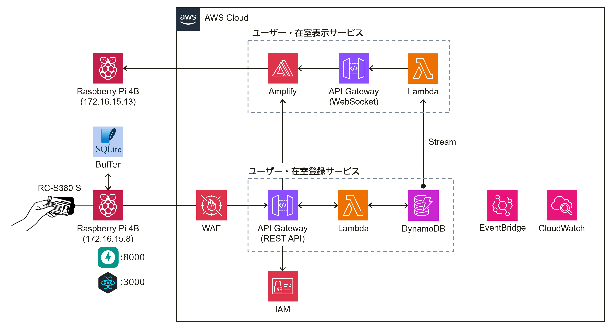

# 【Raspberry Pi】カードリーダー式在籍確認システム

## システム概要図

## システム環境

- Raspberry Pi 4B（ローカルサーバー）

| Raspberry Pi Imager | OS                               | Kernel     |
----                  |----                              |----
| v1.8.5              | Raspbian GNU/Linux 11 (bullseye) | 6.1.21-v8+ |

- FastAPI（ローカルAPIサーバー）
- SQLite（バッファ）
- RC-S380 S（カードリーダー）
- AWS Cloud（クラウドサーバー）

| APIサーバー          | データベース | アクセス制限 | 監視       |
----                  |----         |----         |----
| API Gateway, Lambda | DynamoDB    | IAM, WAF    | CloudWatch |

## 開発言語

- Python
- React

## 仕様定義

- 「NFCカードID」と「ユーザー名」を登録可能
- 同一ユーザーで複数のNFCカードIDを登録可能
- 同一NFCカードIDで複数のユーザーは登録不可能
- 登録済みNFCカードIDで在籍情報を登録可能
- 在籍情報は「出勤」「休入」「休出」「退勤」の4つ
- 在籍情報の変更時に現在籍情報は考慮しない
- 毎日AM0:00に全ユーザーの在籍情報が「退勤」にリセット